# TachoDDD — Pełna dokumentacja UML

## Spis treści
1. [Diagram klas — TachoDddServer](#1-diagram-klas--tachodddserver)
2. [Diagram klas — CardBridgeService](#2-diagram-klas--cardbridgeservice)
3. [Enumeracje i typy wartościowe](#3-enumeracje-i-typy-wartościowe)
4. [Maszyna stanów sesji DDD](#4-pełna-maszyna-stanów-sesji-ddd)
5. [Sekwencja — Pełna sesja DDD](#5-sekwencja--pełna-sesja-ddd)
6. [Diagram komponentów — Edge Functions](#6-diagram-komponentów--edge-functions)
7. [Diagram pakietów — Codec 12](#7-diagram-pakietów--codec-12)
8. [Model danych (ERD)](#8-model-danych-erd--pełny)
9. [Architektura komponentów](#9-architektura-komponentów)

---

## 1. Diagram klas — TachoDddServer


```mermaid
classDiagram
    class DddSession {
        -TcpClient _client
        -CardBridgeClient _bridge
        -string _outputDir
        -ILogger _logger
        -TrafficLogger _trafficLogger
        -SessionDiagnostics _diagnostics
        -WebReporter _webReporter
        -SessionState _state
        -string _imei
        -VuGeneration _vuGeneration
        -string _cardGeneration
        -string _detectedVuGenFromApdu
        -byte _features
        -byte _resumeState
        -uint _lastSequenceNumber
        -int _successfulDownloads
        -List~DddFileType~ _filesToDownload
        -int _currentFileIndex
        -DddFileType _currentFileType
        -List~byte~ _fileBuffer
        -Dictionary~DddFileType,byte[]~ _downloadedFiles
        -int _crcRetryCount
        -bool _retryingWithGen1
        -int _authRetryCount
        -bool _driverCardRetried
        -Dictionary~DddFileType,DateTime~ _fileRequestTimestamps
        +DddSession(TcpClient, CardBridgeClient, string, ILogger, string, bool, WebReporter)
        +RunAsync() Task
        -TransitionTo(SessionState, string) void
        -HandleImeiPacket(NetworkStream, List~byte~) Task
        -ProcessFrameAsync(NetworkStream, Codec12Frame) Task
        -HandleStatusPacket(NetworkStream, DddPacketType, byte[]) Task
        -StartAuthenticationAsync(NetworkStream) Task
        -ProbeCardGenerationAsync() Task~string~
        -TryResetCardState() Task
        -HandleApduLoop(NetworkStream, DddPacketType, byte[]) Task
        -HandleInterfaceVersionResponse(NetworkStream, DddPacketType, byte[]) Task
        -StartDownloadListAsync(NetworkStream) Task
        -BuildFileList() void
        -BuildDownloadListPayload() byte[]
        -GetTrtp(DddFileType, VuGeneration) byte
        -HandleDownloadListAck(NetworkStream, DddPacketType, byte[]) Task
        -RequestNextFileAsync(NetworkStream) Task
        -RequestFileAsync(NetworkStream, DddFileType, VuGeneration) Task
        -HandleFileData(NetworkStream, DddPacketType, byte[]) Task
        -SaveCurrentFile() void
        -MergeVuFiles() void
        -HandleError(byte[]) void
        -DetectCardGeneration(byte[]) string$
        -DetectVuGenerationFromApdu(byte[]) string$
        -VerifyGenerationFromOverview(byte[]) void
        -ScanForGenerationTags(byte[]) VuGeneration
        -SendTerminateAsync(NetworkStream, string) Task
        -SendDddPacketAsync(NetworkStream, DddPacketType, byte[]) Task
        -SendRawAsync(NetworkStream, byte[]) Task
    }

    class CardBridgeClient {
        -string _url
        -ILogger _logger
        -ClientWebSocket _ws
        -TimeSpan CommandTimeout$
        +CardBridgeClient(string, ILogger)
        +ConnectAsync() Task
        +GetAtrAsync() Task~byte[]~
        +TransmitApduAsync(byte[]) Task~byte[]~
        +ReconnectAsync() Task
        -SendCommandAsync(string, byte[]) Task~byte[]~
        +Dispose() void
    }

    class WebReporter {
        -HttpClient _http
        -string _url
        -string _apiKey
        -bool _enabled
        -ILogger _logger
        -string _sessionId
        -string _imei
        -VuGeneration _generation
        -string _cardGeneration
        -List~Task~ _inFlight
        +WebReporter(string, string, string, bool, ILogger)
        +SetImei(string) void
        +SetGeneration(VuGeneration) void
        +SetCardGeneration(string) void
        +ReportStatus(string, int, int, int, string, long, int, int, string, string, string) void
        +ReportError(string, string, int, int) void
        +FlushAsync() Task
        +CheckDownloadScheduleAsync() Task~bool~
        +UploadLogsAsync(string, string, string) Task
        +SessionId string
        +Dispose() void
    }

    class TrafficLogger {
        -StreamWriter _writer
        -object _lock
        +TrafficLogger(string, string)
        +Log(string, byte[], int) void
        +LogDecoded(string, string, int, string) void
        +LogDecodedWithHex(string, string, byte[], int, string) void
        +LogStateChange(SessionState, SessionState, string) void
        +LogError(string, string) void
        +LogError(string, Exception) void
        +LogWarning(string) void
        +LogSummary(string) void
        +Dispose() void
    }

    class SessionDiagnostics {
        +string SessionId
        +string Endpoint
        +string Imei
        +DateTime StartTime
        +DateTime EndTime
        +VuGeneration Generation
        +string CardGeneration
        +string DetectedVuGenFromApdu
        +CardProbeResult CardProbe
        +long BytesSent
        +long BytesReceived
        +int ApduExchanges
        +int CrcErrors
        +int PacketsSent
        +int PacketsReceived
        -List~StateTransitionEntry~ _stateTransitions
        -List~PacketLogEntry~ _packetLog
        -List~ErrorEntry~ _errors
        -List~WarningEntry~ _warnings
        -List~FileDownloadEntry~ _fileDownloads
        +LogStateTransition(SessionState, SessionState, string) void
        +LogPacket(string, byte, int, string) void
        +LogError(string, Exception) void
        +LogError(string, string) void
        +LogWarning(string) void
        +StartFileTimer(DddFileType) void
        +StopFileTimer(DddFileType, int, bool, string) void
        +Finish() void
        +GenerateSummary() string
        +SaveToFile(string) void
    }

    class Codec12Parser {
        +Parse(byte[], int) Codec12Frame$
        +ParseWithCrc(byte[], int) Codec12ParseResult$
        +Build(byte[]) byte[]$
        -Crc16(byte[], int, int) ushort$
    }

    class DddPacket {
        +Build(DddPacketType, byte[]) byte[]$
        +Parse(byte[]) (DddPacketType,byte[])$
    }

    class DddErrorCodes {
        +Describe(byte, byte) string$
        +Format(byte, byte) string$
        +IsGenerationMismatch(byte, byte) bool$
    }

    class DddFileWriter {
        +Save(string, byte[]) void$
        +Append(string, byte[]) void$
    }

    class Codec12Frame {
        +byte Type
        +byte[] Data
    }

    class Codec12ParseResult {
        +Codec12Frame Frame
        +bool CrcError
        +int ConsumedBytes
    }

    class CardProbeResult {
        +string SelectMfSw
        +string SelectDfSw
        +string SelectEfIccSw
        +string ReadBinarySw
        +int ReadBinaryLen
        +string EfIccHex
        +byte GenByte
        +string Result
        +string Error
    }

    DddSession --> CardBridgeClient : APDU tunnel
    DddSession --> WebReporter : HTTP reporting
    DddSession --> TrafficLogger : hex logging
    DddSession --> SessionDiagnostics : diagnostics
    DddSession --> Codec12Parser : parse/build frames
    DddSession --> DddPacket : parse/build DDD
    DddSession --> DddErrorCodes : error lookup
    DddSession --> DddFileWriter : save files
    DddSession --> Codec12Frame : frame data
    SessionDiagnostics --> CardProbeResult : EF_ICC probe
    Codec12Parser --> Codec12Frame : produces
    Codec12Parser --> Codec12ParseResult : produces
    SessionDiagnostics *-- CardProbeResult
```

---

## 2. Diagram klas — CardBridgeService

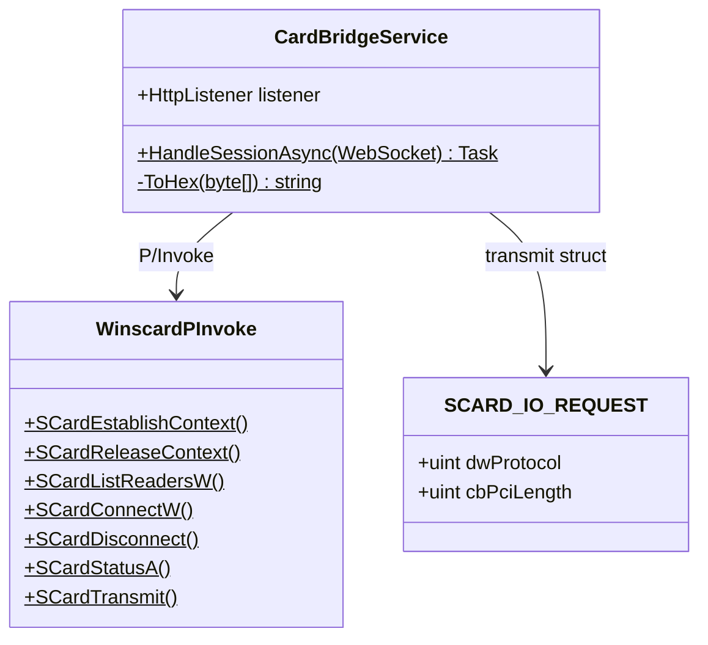
```mermaid
classDiagram
    class CardBridgeService {
        +HttpListener listener
        +HandleSessionAsync(WebSocket) Task$
        -ToHex(byte[]) string$
    }

    class SCARD_IO_REQUEST {
        +uint dwProtocol
        +uint cbPciLength
    }

    class WinscardPInvoke {
        +SCardEstablishContext()$
        +SCardReleaseContext()$
        +SCardListReadersW()$
        +SCardConnectW()$
        +SCardDisconnect()$
        +SCardStatusA()$
        +SCardTransmit()$
    }

    CardBridgeService --> WinscardPInvoke : P/Invoke
    CardBridgeService --> SCARD_IO_REQUEST : transmit struct
```

> **Uwaga:** CardBridgeService to serwer WebSocket na porcie 5201. Obsługuje komendy: `GET_ATR`, `TRANSMIT`, `RECONNECT` w formacie JSON przez WebSocket.

---

## 3. Enumeracje i typy wartościowe

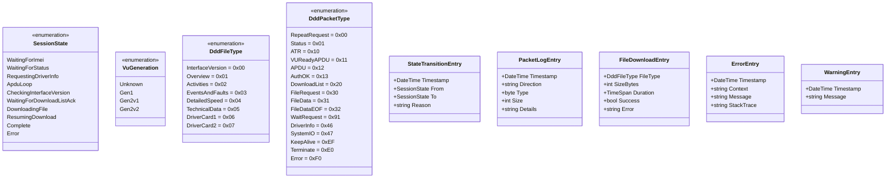
```mermaid
classDiagram
    class SessionState {
        <<enumeration>>
        WaitingForImei
        WaitingForStatus
        RequestingDriverInfo
        ApduLoop
        CheckingInterfaceVersion
        WaitingForDownloadListAck
        DownloadingFile
        ResumingDownload
        Complete
        Error
    }

    class VuGeneration {
        <<enumeration>>
        Unknown
        Gen1
        Gen2v1
        Gen2v2
    }

    class DddFileType {
        <<enumeration>>
        InterfaceVersion = 0x00
        Overview = 0x01
        Activities = 0x02
        EventsAndFaults = 0x03
        DetailedSpeed = 0x04
        TechnicalData = 0x05
        DriverCard1 = 0x06
        DriverCard2 = 0x07
    }

    class DddPacketType {
        <<enumeration>>
        RepeatRequest = 0x00
        Status = 0x01
        ATR = 0x10
        VUReadyAPDU = 0x11
        APDU = 0x12
        AuthOK = 0x13
        DownloadList = 0x20
        FileRequest = 0x30
        FileData = 0x31
        FileDataEOF = 0x32
        WaitRequest = 0x91
        DriverInfo = 0x46
        SystemIO = 0x47
        KeepAlive = 0xEF
        Terminate = 0xE0
        Error = 0xF0
    }

    class StateTransitionEntry {
        +DateTime Timestamp
        +SessionState From
        +SessionState To
        +string Reason
    }

    class PacketLogEntry {
        +DateTime Timestamp
        +string Direction
        +byte Type
        +int Size
        +string Details
    }

    class FileDownloadEntry {
        +DddFileType FileType
        +int SizeBytes
        +TimeSpan Duration
        +bool Success
        +string Error
    }

    class ErrorEntry {
        +DateTime Timestamp
        +string Context
        +string Message
        +string StackTrace
    }

    class WarningEntry {
        +DateTime Timestamp
        +string Message
    }
```

---

## 4. Pełna maszyna stanów sesji DDD

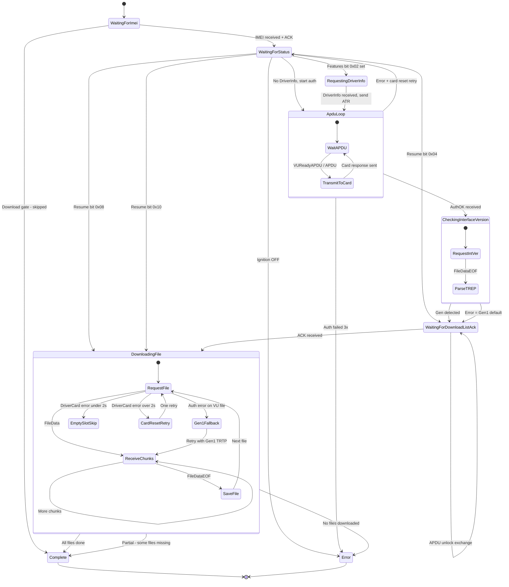
```mermaid
stateDiagram-v2
    [*] --> WaitingForImei

    WaitingForImei --> WaitingForStatus : IMEI received + ACK
    WaitingForImei --> Complete : Download gate - skipped

    WaitingForStatus --> Error : Ignition OFF
    WaitingForStatus --> RequestingDriverInfo : Features bit 0x02 set
    WaitingForStatus --> ApduLoop : No DriverInfo, start auth
    WaitingForStatus --> WaitingForDownloadListAck : Resume bit 0x04
    WaitingForStatus --> DownloadingFile : Resume bit 0x08
    WaitingForStatus --> DownloadingFile : Resume bit 0x10

    RequestingDriverInfo --> ApduLoop : DriverInfo received, send ATR

    state ApduLoop {
        [*] --> WaitAPDU
        WaitAPDU --> TransmitToCard : VUReadyAPDU / APDU
        TransmitToCard --> WaitAPDU : Card response sent
    }
    ApduLoop --> CheckingInterfaceVersion : AuthOK received
    ApduLoop --> Error : Auth failed 3x
    ApduLoop --> WaitingForStatus : Error + card reset retry

    state CheckingInterfaceVersion {
        [*] --> RequestIntVer
        RequestIntVer --> ParseTREP : FileDataEOF
    }
    CheckingInterfaceVersion --> WaitingForDownloadListAck : Gen detected
    CheckingInterfaceVersion --> WaitingForDownloadListAck : Error = Gen1 default

    WaitingForDownloadListAck --> DownloadingFile : ACK received
    WaitingForDownloadListAck --> WaitingForDownloadListAck : APDU unlock exchange

    state DownloadingFile {
        [*] --> RequestFile
        RequestFile --> ReceiveChunks : FileData
        ReceiveChunks --> ReceiveChunks : More chunks
        ReceiveChunks --> SaveFile : FileDataEOF
        SaveFile --> RequestFile : Next file
        RequestFile --> Gen1Fallback : Auth error on VU file
        Gen1Fallback --> ReceiveChunks : Retry with Gen1 TRTP
        RequestFile --> EmptySlotSkip : DriverCard error under 2s
        RequestFile --> CardResetRetry : DriverCard error over 2s
        CardResetRetry --> RequestFile : One retry
    }
    DownloadingFile --> Complete : All files done
    DownloadingFile --> Complete : Partial - some files missing
    DownloadingFile --> Error : No files downloaded

    Complete --> [*]
    Error --> [*]
```

---

## 5. Sekwencja — Pełna sesja DDD

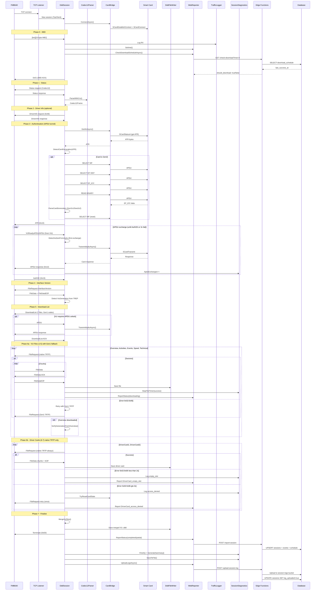
```mermaid
sequenceDiagram
    participant FM as FMB640
    participant TCP as TCP Listener
    participant DS as DddSession
    participant C12 as Codec12Parser
    participant CB as CardBridge
    participant Card as Smart Card
    participant FW as DddFileWriter
    participant WR as WebReporter
    participant TL as TrafficLogger
    participant SD as SessionDiagnostics
    participant EF as Edge Functions
    participant DB as Database

    FM->>TCP: TCP connect
    TCP->>DS: New session (TcpClient)
    DS->>CB: ConnectAsync()
    CB->>Card: SCardEstablishContext + SCardConnect

    Note over FM,DS: Phase 0 - IMEI
    FM->>DS: [len][15-byte IMEI]
    DS->>TL: Log RX
    DS->>WR: SetImei()
    DS->>WR: CheckDownloadScheduleAsync()
    WR->>EF: GET /check-download?imei=X
    EF->>DB: SELECT download_schedule
    DB-->>EF: last_success_at
    EF-->>WR: should_download: true/false
    DS->>FM: 0x01 (IMEI ACK)

    Note over FM,DS: Phase 1 - Status
    DS->>FM: Status request (Codec12)
    FM->>DS: Status response
    DS->>C12: ParseWithCrc()
    C12-->>DS: Codec12Frame

    Note over FM,DS: Phase 2 - Driver Info (optional)
    DS->>FM: DriverInfo request (0x46)
    FM-->>DS: DriverInfo response

    Note over FM,DS: Phase 3 - Authentication (APDU tunnel)
    DS->>CB: GetAtrAsync()
    CB->>Card: SCardStatusA (get ATR)
    Card-->>CB: ATR bytes
    CB-->>DS: ATR
    DS->>DS: DetectCardGeneration(ATR)
    opt Card is Gen2
        DS->>CB: SELECT MF
        CB->>Card: APDU
        DS->>CB: SELECT DF 0007
        CB->>Card: APDU
        DS->>CB: SELECT EF_ICC
        CB->>Card: APDU
        DS->>CB: READ BINARY
        CB->>Card: APDU
        Card-->>CB: EF_ICC data
        DS->>DS: ParseCardGeneration (Gen2v1/Gen2v2)
        DS->>CB: SELECT MF (reset)
    end
    DS->>FM: ATR (0x10)
    loop APDU exchange (until AuthOK or 3x fail)
        FM->>DS: VUReadyAPDU/APDU (from VU)
        DS->>DS: DetectVuGenFromApdu (first exchange)
        DS->>CB: TransmitApduAsync()
        CB->>Card: SCardTransmit
        Card-->>CB: Response
        CB-->>DS: Card response
        DS->>FM: APDU response (0x12)
        DS->>SD: ApduExchanges++
    end
    FM->>DS: AuthOK (0x13)

    Note over FM,DS: Phase 4 - Interface Version
    DS->>FM: FileRequest InterfaceVersion
    FM->>DS: FileData + FileDataEOF
    DS->>DS: Detect VuGeneration from TREP

    Note over FM,DS: Phase 5 - Download List
    DS->>FM: DownloadList (7 files, Gen1 codes)
    opt VU requires APDU unlock
        FM->>DS: APDU
        DS->>CB: TransmitApduAsync()
        DS->>FM: APDU response
    end
    FM->>DS: DownloadList ACK

    Note over FM,DS: Phase 6a - VU Files (1-5) with Gen1 fallback
    loop Overview, Activities, Events, Speed, Technical
        DS->>FM: FileRequest (native TRTP)
        alt Success
            loop Chunks
                FM->>DS: FileData
                DS->>FM: FileData ACK
            end
            FM->>DS: FileDataEOF
            DS->>FW: Save file
            DS->>SD: StopFileTimer(success)
            DS->>WR: ReportStatus(downloading)
        else Error 0x02:0x06
            DS->>DS: Retry with Gen1 TRTP
            DS->>FM: FileRequest (Gen1 TRTP)
        end
        opt Overview downloaded
            DS->>DS: VerifyGenerationFromOverview()
        end
    end

    Note over FM,DS: Phase 6b - Driver Cards (6-7) native TRTP only
    loop DriverCard1, DriverCard2
        DS->>FM: FileRequest (native TRTP always)
        alt Success
            FM->>DS: FileData chunks + EOF
            DS->>FW: Save driver card
        else Error 0x02:0x06 less than 2s
            DS->>SD: Log empty_slot
            DS->>WR: Report DriverCard_empty_slot
        else Error 0x02:0x06 gte 2s
            DS->>SD: Log access_denied
            DS->>CB: TryResetCardState
            DS->>FM: FileRequest retry (once)
            DS->>WR: Report DriverCard_access_denied
        end
    end

    Note over FM,DS: Phase 7 - Finalize
    DS->>DS: MergeVuFiles()
    DS->>FW: Save merged VU .ddd
    DS->>FM: Terminate (0xE0)
    DS->>WR: ReportStatus(completed/partial)
    WR->>EF: POST /report-session
    EF->>DB: UPSERT sessions + events + schedule
    DS->>SD: Finish() + GenerateSummary()
    DS->>SD: SaveToFile()
    DS->>WR: UploadLogsAsync()
    WR->>EF: POST /upload-session-log
    EF->>DB: Upload to session-logs bucket
    EF->>DB: UPDATE sessions SET log_uploaded=true
```

---

## 6. Diagram komponentów — TachoWebApi + Edge Functions

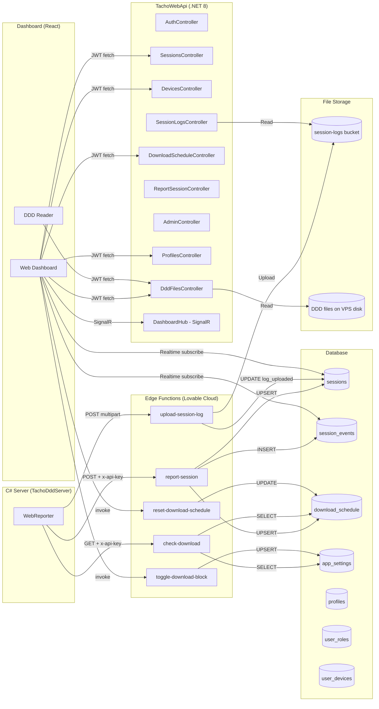
```mermaid
graph LR
    subgraph "C# Server (TachoDddServer)"
        WR[WebReporter]
    end

    subgraph "TachoWebApi (.NET 8)"
        AUTH[AuthController]
        SESS[SessionsController]
        DEV[DevicesController]
        DDD[DddFilesController]
        SCHED[DownloadScheduleController]
        REPORT[ReportSessionController]
        ADMIN[AdminController]
        PROF[ProfilesController]
        SLOG[SessionLogsController]
        HUB[DashboardHub - SignalR]
    end

    subgraph "Edge Functions (Lovable Cloud)"
        RS[report-session]
        CD[check-download]
        UL[upload-session-log]
        TB[toggle-download-block]
        RDS[reset-download-schedule]
    end

    subgraph "Database"
        S[(sessions)]
        SE[(session_events)]
        DS[(download_schedule)]
        AS[(app_settings)]
        P[(profiles)]
        UR[(user_roles)]
        UD[(user_devices)]
    end

    subgraph "File Storage"
        SL[(session-logs bucket)]
        DDDFS[(DDD files on VPS disk)]
    end

    subgraph "Dashboard (React)"
        UI[Web Dashboard]
        READER[DDD Reader]
    end

    WR -->|POST + x-api-key| RS
    WR -->|GET + x-api-key| CD
    WR -->|POST multipart| UL

    RS -->|UPSERT| S
    RS -->|INSERT| SE
    RS -->|UPSERT| DS

    CD -->|SELECT| DS
    CD -->|SELECT| AS

    UL -->|Upload| SL
    UL -->|UPDATE log_uploaded| S

    TB -->|UPSERT| AS
    RDS -->|UPDATE| DS

    DDD -->|Read| DDDFS
    SLOG -->|Read| SL

    UI -->|Realtime subscribe| S
    UI -->|Realtime subscribe| SE
    UI -->|JWT fetch| SESS
    UI -->|JWT fetch| SCHED
    UI -->|JWT fetch| DDD
    UI -->|JWT fetch| DEV
    UI -->|JWT fetch| PROF
    UI -->|SignalR| HUB
    UI -->|invoke| TB
    UI -->|invoke| RDS
    READER -->|JWT fetch| DDD
```

---

## 6a. Endpointy TachoWebApi

| Kontroler | Metoda | Endpoint | Opis |
|---|---|---|---|
| **AuthController** | POST | `/api/auth/login` | Logowanie (JWT) |
| | POST | `/api/auth/signup` | Rejestracja |
| | POST | `/api/auth/refresh` | Odświeżenie tokena |
| | POST | `/api/auth/forgot-password` | Reset hasła |
| | POST | `/api/auth/reset-password` | Ustawienie nowego hasła |
| **SessionsController** | GET | `/api/sessions` | Lista sesji (filtr po IMEI) |
| **DevicesController** | GET/POST/PUT/DELETE | `/api/devices` | CRUD urządzeń użytkownika |
| **DddFilesController** | GET | `/api/ddd-files/{imei}` | Lista plików DDD (okno czasowe) |
| | GET | `/api/ddd-files/{imei}/{fileName}` | Pobieranie pojedynczego pliku |
| | GET | `/api/ddd-files/{imei}/zip` | Pobieranie archiwum ZIP |
| **DownloadScheduleController** | GET | `/api/download-schedule` | Harmonogram pobierania |
| **ReportSessionController** | POST | `/api/report-session` | Raportowanie sesji (x-api-key) |
| **ProfilesController** | GET/PUT | `/api/profiles` | Profil użytkownika |
| **AdminController** | POST | `/api/admin/create-user` | Tworzenie użytkownika (admin) |
| **SettingsController** | GET/PUT | `/api/settings` | Ustawienia aplikacji |
| **SessionLogsController** | GET | `/api/session-logs/{sessionId}` | Pobieranie logów sesji |
| **CheckDownloadController** | GET | `/api/check-download` | Sprawdzenie harmonogramu (x-api-key) |

---

## 7. Diagram pakietów — Codec 12

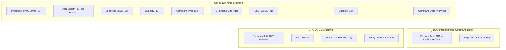
```mermaid
graph TB
    subgraph "Codec 12 Frame Structure"
        direction TB
        P1["Preamble: 00 00 00 00 (4B)"]
        P2["Data Length (4B, big-endian)"]
        P3["Codec ID: 0x0C (1B)"]
        P4["Quantity (1B)"]
        P5["Command Type (1B)"]
        P6["Command Size (4B)"]
        P7["Command Data (N bytes)"]
        P8["Quantity (1B)"]
        P9["CRC-16/IBM (4B)"]
    end

    subgraph "DDD Packet (inside Command Data)"
        direction TB
        D1["Payload Type (1B) = DddPacketType"]
        D2["Payload Data (M bytes)"]
    end

    subgraph "CRC-16/IBM Algorithm"
        direction TB
        C1["Polynomial: 0xA001 reflected"]
        C2["Init: 0x0000"]
        C3["Scope: data section only"]
        C4["Verify: BE or LE match"]
    end

    P7 --> D1
    P9 --> C1
```

---

## 8. Model danych (ERD) — pełny

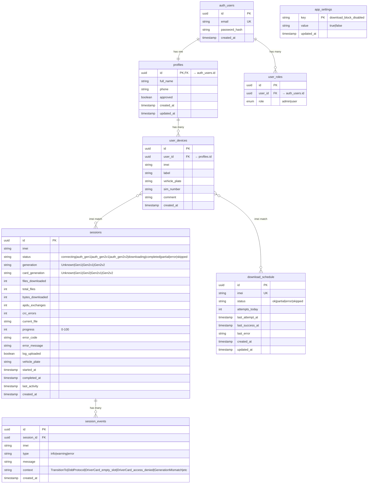
```mermaid
erDiagram
    auth_users {
        uuid id PK
        string email UK
        string password_hash
        timestamp created_at
    }

    profiles {
        uuid id PK,FK "→ auth_users.id"
        string full_name
        string phone
        boolean approved
        timestamp created_at
        timestamp updated_at
    }

    user_roles {
        uuid id PK
        uuid user_id FK "→ auth_users.id"
        enum role "admin|user"
    }

    user_devices {
        uuid id PK
        uuid user_id FK "→ profiles.id"
        string imei
        string label
        string vehicle_plate
        string sim_number
        string comment
        timestamp created_at
    }

    sessions {
        uuid id PK
        string imei
        string status "connecting|auth_gen1|auth_gen2v1|auth_gen2v2|downloading|completed|partial|error|skipped"
        string generation "Unknown|Gen1|Gen2v1|Gen2v2"
        string card_generation "Unknown|Gen1|Gen2|Gen2v1|Gen2v2"
        int files_downloaded
        int total_files
        int bytes_downloaded
        int apdu_exchanges
        int crc_errors
        string current_file
        int progress "0-100"
        string error_code
        string error_message
        boolean log_uploaded
        string vehicle_plate
        timestamp started_at
        timestamp completed_at
        timestamp last_activity
        timestamp created_at
    }

    session_events {
        uuid id PK
        uuid session_id FK
        string imei
        string type "info|warning|error"
        string message
        string context "TransitionTo|DddProtocol|DriverCard_empty_slot|DriverCard_access_denied|GenerationMismatch|etc"
        timestamp created_at
    }

    download_schedule {
        uuid id PK
        string imei UK
        string status "ok|partial|error|skipped"
        int attempts_today
        timestamp last_attempt_at
        timestamp last_success_at
        string last_error
        timestamp created_at
        timestamp updated_at
    }

    app_settings {
        string key PK "download_block_disabled"
        string value "true|false"
        timestamp updated_at
    }

    auth_users ||--|| profiles : "has one"
    auth_users ||--o{ user_roles : "has many"
    profiles ||--o{ user_devices : "has many"
    sessions ||--o{ session_events : "has many"
    user_devices }o--o{ sessions : "imei match"
    user_devices }o--o{ download_schedule : "imei match"
```

---

## 9. Architektura komponentów

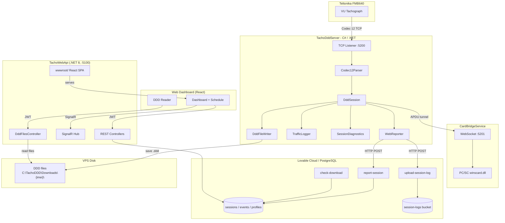
```mermaid
graph TB
    subgraph Device["Teltonika FMB640"]
        VU[VU Tachograph]
    end

    subgraph Server["TachoDddServer - C# / .NET"]
        TCP[TCP Listener :5200]
        Codec[Codec12Parser]
        Session[DddSession]
        FileWriter[DddFileWriter]
        Traffic[TrafficLogger]
        Diag[SessionDiagnostics]
        Reporter[WebReporter]
    end

    subgraph Bridge["CardBridgeService"]
        WS[WebSocket :5201]
        PCSC[PC/SC winscard.dll]
    end

    subgraph WebApi["TachoWebApi (.NET 8, :5100)"]
        API[REST Controllers]
        SIGNALR[SignalR Hub]
        DDDCTRL[DddFilesController]
        STATIC["wwwroot/ React SPA"]
    end

    subgraph Cloud["Lovable Cloud / PostgreSQL"]
        DB[(sessions / events / profiles)]
        EF1[report-session]
        EF2[check-download]
        EF3[upload-session-log]
        Storage[(session-logs bucket)]
    end

    subgraph VPSDisk["VPS Disk"]
        DDDFILES["DDD files<br/>C:\TachoDDD\Downloads\{imei}\"]
    end

    subgraph Dashboard["Web Dashboard (React)"]
        MAIN[Dashboard + Schedule]
        READER[DDD Reader]
    end

    VU -->|Codec 12 TCP| TCP
    TCP --> Codec
    Codec --> Session
    Session -->|APDU tunnel| WS
    WS --> PCSC
    Session --> FileWriter
    FileWriter -->|save .ddd| DDDFILES
    Session --> Traffic
    Session --> Diag
    Session --> Reporter
    Reporter -->|HTTP POST| EF1
    Reporter -->|HTTP POST| EF3
    EF1 --> DB
    EF3 --> Storage
    EF2 --> DB
    MAIN -->|JWT| API
    MAIN -->|SignalR| SIGNALR
    READER -->|JWT| DDDCTRL
    DDDCTRL -->|read files| DDDFILES
    API --> DB
    STATIC -->|serves| MAIN
```

---

## 10. Statusy sesji — nazewnictwo i logika przejść

### Tabela statusów

| Status DB | Label PL (UI) | Opis | Kiedy ustawiany |
|-----------|---------------|------|-----------------|
| `connecting` | Łączenie | Sesja TCP nawiązana, oczekiwanie na IMEI | Utworzenie sesji |
| `auth_gen1` | Autentykacja Gen1 | Autentykacja APDU z kartą Gen1 | Po wykryciu karty Gen1 |
| `auth_gen2v1` | Autentykacja Gen2v1 | Autentykacja APDU z kartą Gen2v1 | Po wykryciu karty Gen2v1 |
| `auth_gen2v2` | Autentykacja Gen2v2 | Autentykacja APDU z kartą Gen2v2 | Po wykryciu karty Gen2v2 |
| `downloading` | Pobieranie | Trwa pobieranie plików DDD z VU | Po AuthOK i rozpoczęciu pobierania |
| `completed` | Ukończono | Wszystkie pliki pobrane pomyślnie | Wszystkie pliki VU + karty pobrane |
| `partial` | Częściowe | Część plików pobrana (np. brak karty) | ≥1 plik pobrany, ale nie wszystkie |
| `error` | Błąd | Sesja zakończona błędem | Błąd krytyczny (auth 3x, disconnect) |
| `skipped` | Pominięto | Pobieranie pominięte (cooldown/blokada) | check-download zwrócił should_download=false |

### Statusy specjalne w UI (nie zapisywane w DB)

| Label PL | Warunek | Opis |
|----------|---------|------|
| Stacyjka OFF | `files_downloaded=0 AND apdu_exchanges=0 AND status=error` | Urządzenie zgłosiło błąd bez żadnej wymiany danych |
| VU offline | `error_code zawiera "01:04" lub "01:01"` | Tachograf nie odpowiedział |
| Lockout | `error_message zawiera "Lockout"` | Urządzenie zablokowane po zbyt wielu próbach |

### Logika `getEffectiveStatus()` w UI

```typescript
// Priorytet: completed_at > status z DB
if (session.completed_at && session.status === "downloading") {
  return session.files_downloaded >= session.total_files ? "completed" : "partial";
}
```

### Diagram przejść statusów

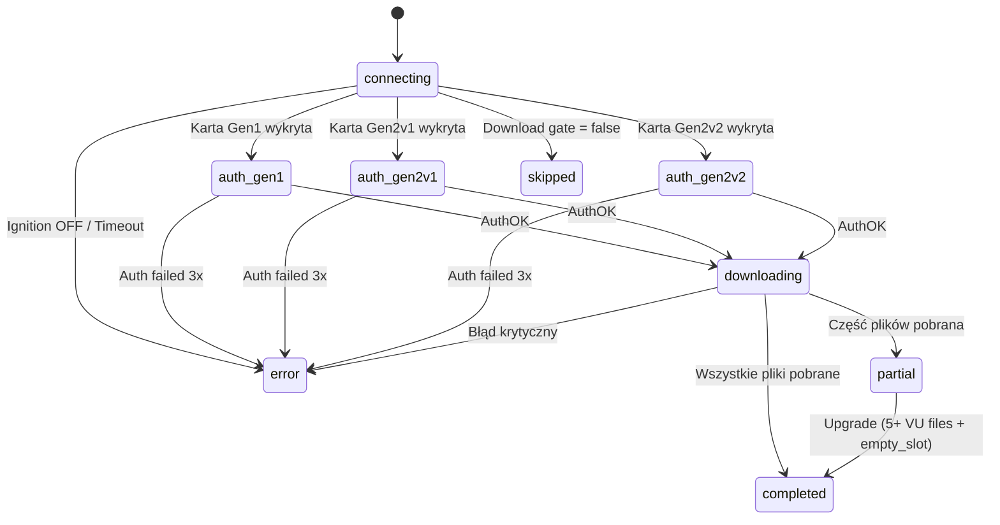
```mermaid
stateDiagram-v2
    [*] --> connecting
    connecting --> auth_gen1 : Karta Gen1 wykryta
    connecting --> auth_gen2v1 : Karta Gen2v1 wykryta
    connecting --> auth_gen2v2 : Karta Gen2v2 wykryta
    connecting --> skipped : Download gate = false
    connecting --> error : Ignition OFF / Timeout

    auth_gen1 --> downloading : AuthOK
    auth_gen2v1 --> downloading : AuthOK
    auth_gen2v2 --> downloading : AuthOK
    auth_gen1 --> error : Auth failed 3x
    auth_gen2v1 --> error : Auth failed 3x
    auth_gen2v2 --> error : Auth failed 3x

    downloading --> completed : Wszystkie pliki pobrane
    downloading --> partial : Część plików pobrana
    downloading --> error : Błąd krytyczny

    partial --> completed : Upgrade (5+ VU files + empty_slot)
```

---

## 11. Race condition protection (report-session)

Edge function `report-session` chroni statusy końcowe przed nadpisaniem przez spóźnione raporty:

```
FINAL_STATUSES = ["completed", "partial", "error", "skipped"]

1. Pobierz obecny status i completed_at z DB
2. Jeśli obecny status jest FINAL lub completed_at jest ustawiony:
   - NIE pozwól na nadpisanie statusem nie-finalnym (np. "downloading")
   - Loguj: "STATUS PROTECTION: keeping 'completed', ignoring 'downloading'"
3. Jeśli nowy status jest FINAL — zapisz normalnie
```

### Znany problem: Stuck "downloading"

Race condition występuje gdy:
1. Serwer C# wysyła raport `status=completed` (szybko)
2. Spóźniony raport `status=downloading` dociera po completed
3. Bez ochrony — status wracał do "downloading" mimo completed_at

**Rozwiązanie:** `getEffectiveStatus()` w UI sprawdza `completed_at` i nadpisuje surowy status z DB.

---

## 12. Partial → Completed upgrade

Edge function automatycznie upgraduje status `partial` do `completed` gdy:

```
Warunki:
  - incoming status = "partial"
  - files_downloaded >= 5 (wszystkie pliki VU)
  - Sprawdź session_events dla warning/error:
    - Filtruj zdarzenia zawierające "Slot 1", "Slot 2", "card"
    - Jeśli WSZYSTKIE takie zdarzenia to "empty_slot" / "Empty slot"
      → UPGRADE do "completed"
    - Jeśli brak zdarzeń card issues → UPGRADE do "completed"
```

**Uzasadnienie:** Brak karty w slocie (empty_slot) to normalna sytuacja — kierowca nie musi mieć karty włożonej. Jeśli wszystkie 5 plików VU zostało pobrane, sesja jest kompletna.

---

## 13. Download gate (check-download + schedule)

### Przepływ

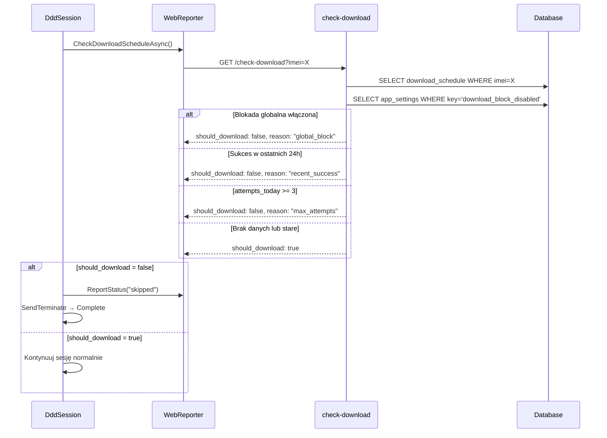
```mermaid
sequenceDiagram
    participant DS as DddSession
    participant WR as WebReporter
    participant CD as check-download
    participant DB as Database

    DS->>WR: CheckDownloadScheduleAsync()
    WR->>CD: GET /check-download?imei=X
    CD->>DB: SELECT download_schedule WHERE imei=X
    CD->>DB: SELECT app_settings WHERE key='download_block_disabled'

    alt Blokada globalna włączona
        CD-->>WR: should_download: false, reason: "global_block"
    else Sukces w ostatnich 24h
        CD-->>WR: should_download: false, reason: "recent_success"
    else attempts_today >= 3
        CD-->>WR: should_download: false, reason: "max_attempts"
    else Brak danych lub stare
        CD-->>WR: should_download: true
    end

    alt should_download = false
        DS->>WR: ReportStatus("skipped")
        DS->>DS: SendTerminate → Complete
    else should_download = true
        DS->>DS: Kontynuuj sesję normalnie
    end
```

### Tabela download_schedule

| Pole | Opis |
|------|------|
| `imei` | Unikalny identyfikator urządzenia |
| `status` | ok / partial / error / skipped |
| `attempts_today` | Licznik prób dzisiaj (resetowany codziennie o północy) |
| `last_success_at` | Ostatni sukces (completed/partial) |
| `last_attempt_at` | Ostatnia próba (dowolny status końcowy) |
| `last_error` | Opis ostatniego błędu |

---

## 14. DDD Parser (Frontend)

### Strategia parsowania Activities

Parser czynności w `src/lib/ddd-parser.ts` wykorzystuje **sekwencyjną strategię per-dzień**:

```
Dla każdego dnia w bloku danych:
  1. Szukaj Data marker (tag 0x06) → data dnia
  2. Szukaj Odometer (tag 0x05) → stan licznika
  3. Szukaj CardIW (tag 0x0D) → karta kierowcy (insert/withdraw)
  4. Szukaj Activities (tag 0x01) → rekordy czynności
```

### Fallback: Flat-collection z regresją minut

Jeśli parsowanie sekwencyjne nie zwróci wyników:
1. Zbierz WSZYSTKIE rekordy tego samego typu (flat)
2. Podziel na dni wg **regresji minut** — gdy minuty rosną, a potem nagle spadają → nowy dzień
3. Grupuj po obliczonej dacie

### Usuwanie warstwy TRTP

Dane surowe zawierają nagłówki transportowe TRTP (3 bajty: `04 00 01` lub `04 00 02`), które mogą powodować artefakty (np. fałszywe wartości 768 km). Parser je usuwa przed analizą danych.

### Limity

- Limit rekordów: **100 000** (aby obsłużyć pełne 365 dni danych VU)
- Obsługiwane typy plików: Overview, Activities, Events, Speed, Technical, DriverCard

---

## 15. Dual-mode Frontend

Dashboard React działa w dwóch trybach:

### Tryb A: Lovable Cloud (Supabase)

```
Frontend (React) → Supabase Client → Edge Functions → PostgreSQL
                 → Supabase Realtime (WebSocket)
```

- Autentykacja: Supabase Auth
- Realtime: Supabase Realtime (postgres_changes)
- Storage: Supabase Storage (session-logs bucket)
- RLS: Polityki na tabelach (has_role, is_approved, get_user_imeis)

### Tryb B: Self-hosted (TachoWebApi)

```
Frontend (React) → TachoWebApi REST API → PostgreSQL
                 → SignalR Hub (WebSocket)
```

- Autentykacja: JWT (własny AuthController)
- Realtime: SignalR Hub (/hubs/dashboard)
- Storage: System plików VPS (C:\TachoDDD\SessionLogs\)
- Autoryzacja: Middleware ApiKeyAuth + JWT Claims

### Przełączanie trybów

Zmienna środowiskowa `VITE_API_BASE_URL`:
- **Pusta/brak** → Tryb A (Lovable Cloud, domyślny)
- **Ustawiona** (np. `https://tachoddd.example.com`) → Tryb B (Self-hosted)

Warstwa `src/lib/api-client.ts` automatycznie przełącza między Supabase Client a fetch() w zależności od trybu.

---

## Mapowanie TRTP

| DddFileType | Gen1 | Gen2v1 | Gen2v2 | Uwagi |
|---|---|---|---|---|
| InterfaceVersion | 0x00 | 0x00 | 0x00 | Zawsze bazowy |
| Overview | 0x01 | 0x21 | 0x31 | +0x20 / +0x30 |
| Activities | 0x02 | 0x22 | 0x32 | +0x20 / +0x30 |
| EventsAndFaults | 0x03 | 0x23 | 0x33 | +0x20 / +0x30 |
| DetailedSpeed | 0x04 | 0x24 | 0x34 | +0x20 / +0x30 |
| TechnicalData | 0x05 | 0x25 | 0x35 | +0x20 / +0x30 |
| DriverCard1 | 0x06 | 0x06 | 0x06 | Zawsze bazowy (natywny) |
| DriverCard2 | 0x06 | 0x06 | 0x06 | Zawsze bazowy (slot=0x02) |

> **Download List** zawsze używa kodów Gen1 (0x01-0x06). Kody specyficzne dla generacji są stosowane wyłącznie w **FileRequest (0x30)**.

---

## Kody błędów DDD

| Klasa | Kod | Opis |
|---|---|---|
| 0x01 | 0x01-0x06 | Błędy VU (busy, internal, not ready, timeout, empty slot, read error) |
| 0x02 | 0x01-0x0B | Błędy autentykacji (unknown, not recognized, blocked, expired, wrong PIN, data inaccessible, certificate rejected) |
| 0x03 | 0x01-0x05 | Błędy plików (not available, access denied, corrupted, not supported, aborted) |
| 0x04 | 0x01-0x03 | Błędy komunikacji (data link lost, timeout, CRC failure) |
| 0x05 | 0x01-0x03 | Błędy protokołu (unexpected packet, invalid sequence, too large) |
| 0xFF | 0x01/0xFF | Błędy ogólne (general, unknown fatal) |

---

## 10. Dostęp do plików DDD

### Przepływ pobierania plików DDD z dashboardu

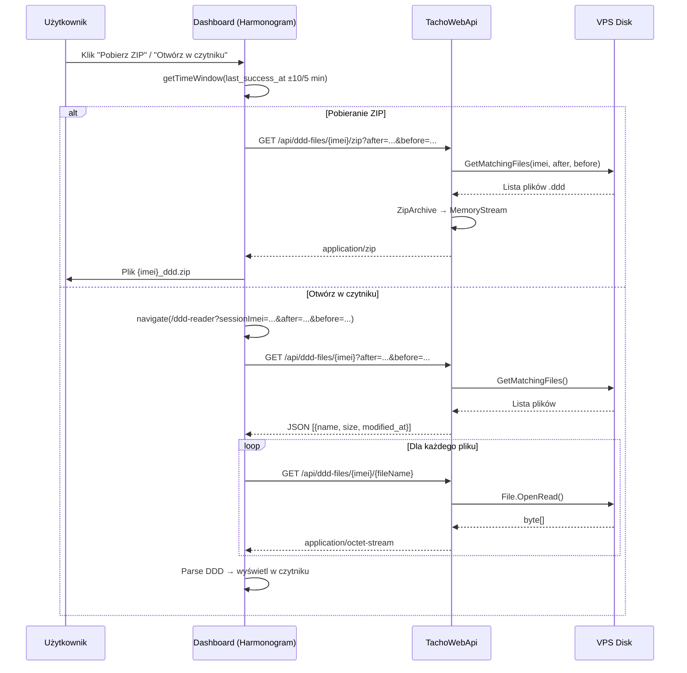
```mermaid
sequenceDiagram
    participant U as Użytkownik
    participant DS as Dashboard (Harmonogram)
    participant API as TachoWebApi
    participant FS as VPS Disk

    U->>DS: Klik "Pobierz ZIP" / "Otwórz w czytniku"
    DS->>DS: getTimeWindow(last_success_at ±10/5 min)
    
    alt Pobieranie ZIP
        DS->>API: GET /api/ddd-files/{imei}/zip?after=...&before=...
        API->>FS: GetMatchingFiles(imei, after, before)
        FS-->>API: Lista plików .ddd
        API->>API: ZipArchive → MemoryStream
        API-->>DS: application/zip
        DS->>U: Plik {imei}_ddd.zip
    else Otwórz w czytniku
        DS->>DS: navigate(/ddd-reader?sessionImei=...&after=...&before=...)
        DS->>API: GET /api/ddd-files/{imei}?after=...&before=...
        API->>FS: GetMatchingFiles()
        FS-->>API: Lista plików
        API-->>DS: JSON [{name, size, modified_at}]
        loop Dla każdego pliku
            DS->>API: GET /api/ddd-files/{imei}/{fileName}
            API->>FS: File.OpenRead()
            FS-->>API: byte[]
            API-->>DS: application/octet-stream
        end
        DS->>DS: Parse DDD → wyświetl w czytniku
    end
```

### Struktura plików na dysku VPS

```
C:\TachoDDD\Downloads\
├── 358480081630115\
│   ├── 358480081630115_overview_20260305_164750.ddd
│   ├── 358480081630115_activities_20260305_164810.ddd
│   ├── 358480081630115_events_20260305_164830.ddd
│   ├── 358480081630115_speed_20260305_164900.ddd
│   └── 358480081630115_technical_20260305_164920.ddd
├── 350424060855218\
│   └── ...
```

---

*Wygenerowano: 2026-03-14*
