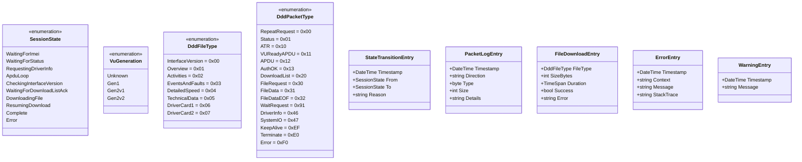

# TachoDDD — Pełna dokumentacja UML

## Spis treści
1. [Diagram klas — TachoDddServer](#1-diagram-klas--tachodddserver)
2. [Diagram klas — CardBridgeService](#2-diagram-klas--cardbridgeservice)
3. [Enumeracje i typy wartościowe](#3-enumeracje-i-typy-wartościowe)
4. [Maszyna stanów sesji DDD](#4-pełna-maszyna-stanów-sesji-ddd)
5. [Sekwencja — Pełna sesja DDD](#5-sekwencja--pełna-sesja-ddd)
6. [Diagram komponentów — Edge Functions](#6-diagram-komponentów--edge-functions)
7. [Diagram pakietów — Codec 12](#7-diagram-pakietów--codec-12)
8. [Model danych (ERD)](#8-model-danych-erd--pełny)
9. [Architektura komponentów](#9-architektura-komponentów)

---

## 1. Diagram klas — TachoDddServer

---

## 2. Diagram klas — CardBridgeService

> **Uwaga:** CardBridgeService to serwer WebSocket na porcie 5201. Obsługuje komendy: `GET_ATR`, `TRANSMIT`, `RECONNECT` w formacie JSON przez WebSocket.

---

## 3. Enumeracje i typy wartościowe

---

## 4. Pełna maszyna stanów sesji DDD

---

## 5. Sekwencja — Pełna sesja DDD

---

## 6. Diagram komponentów — Edge Functions

---

## 7. Diagram pakietów — Codec 12

---

## 8. Model danych (ERD) — pełny

---

## 9. Architektura komponentów

---

## Mapowanie TRTP

| DddFileType | Gen1 | Gen2v1 | Gen2v2 | Uwagi |
|---|---|---|---|---|
| InterfaceVersion | 0x00 | 0x00 | 0x00 | Zawsze bazowy |
| Overview | 0x01 | 0x21 | 0x31 | +0x20 / +0x30 |
| Activities | 0x02 | 0x22 | 0x32 | +0x20 / +0x30 |
| EventsAndFaults | 0x03 | 0x23 | 0x33 | +0x20 / +0x30 |
| DetailedSpeed | 0x04 | 0x24 | 0x34 | +0x20 / +0x30 |
| TechnicalData | 0x05 | 0x25 | 0x35 | +0x20 / +0x30 |
| DriverCard1 | 0x06 | 0x06 | 0x06 | Zawsze bazowy (natywny) |
| DriverCard2 | 0x06 | 0x06 | 0x06 | Zawsze bazowy (slot=0x02) |

> **Download List** zawsze używa kodów Gen1 (0x01-0x06). Kody specyficzne dla generacji są stosowane wyłącznie w **FileRequest (0x30)**.

---

## Kody błędów DDD

| Klasa | Kod | Opis |
|---|---|---|
| 0x01 | 0x01-0x06 | Błędy VU (busy, internal, not ready, timeout, empty slot, read error) |
| 0x02 | 0x01-0x0B | Błędy autentykacji (unknown, not recognized, blocked, expired, wrong PIN, data inaccessible, certificate rejected) |
| 0x03 | 0x01-0x05 | Błędy plików (not available, access denied, corrupted, not supported, aborted) |
| 0x04 | 0x01-0x03 | Błędy komunikacji (data link lost, timeout, CRC failure) |
| 0x05 | 0x01-0x03 | Błędy protokołu (unexpected packet, invalid sequence, too large) |
| 0xFF | 0x01/0xFF | Błędy ogólne (general, unknown fatal) |

---

*Wygenerowano: 2026-02-28*
