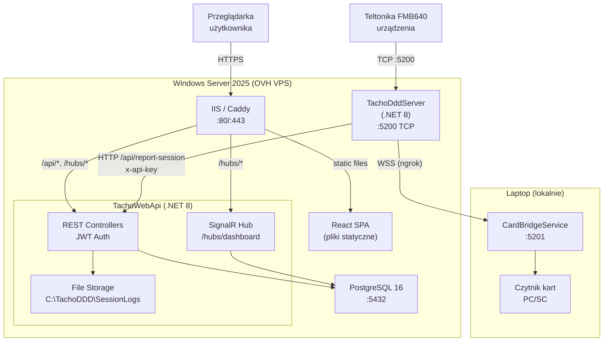

# Migracja TachoDDD Monitor — instalacja TachoWebApi na Windows Server

> **Cel dokumentu:** Krok po kroku zainstalować backend ASP.NET Web API (`TachoWebApi`) na serwerze Windows, zastępując Lovable Cloud (Supabase) własnym lokalnym backendem z PostgreSQL, JWT auth, SignalR i plikowym storage.

---

## Spis treści

1. [Architektura obecna vs docelowa](#1-architektura-obecna-vs-docelowa)
2. [Wymagania](#2-wymagania)
3. [Krok 1 — Instalacja PostgreSQL](#krok-1--instalacja-postgresql)
4. [Krok 2 — Pobranie kodu źródłowego](#krok-2--pobranie-kodu-źródłowego)
5. [Krok 3 — Konfiguracja TachoWebApi](#krok-3--konfiguracja-tachowebapi)
6. [Krok 4 — Migracja bazy danych (EF Core)](#krok-4--migracja-bazy-danych-ef-core)
7. [Krok 5 — Pierwsze uruchomienie i test](#krok-5--pierwsze-uruchomienie-i-test)
8. [Krok 6 — Tworzenie pierwszego admina](#krok-6--tworzenie-pierwszego-admina)
9. [Krok 7 — Konfiguracja TachoDddServer](#krok-7--konfiguracja-tachodddserver)
10. [Krok 8 — Build i deploy frontendu](#krok-8--build-i-deploy-frontendu)
11. [Krok 9 — Instalacja jako Windows Service](#krok-9--instalacja-jako-windows-service)
12. [Krok 10 — Reverse proxy (IIS / Caddy)](#krok-10--reverse-proxy-iis--caddy)
13. [Krok 11 — SSL i firewall](#krok-11--ssl-i-firewall)
14. [Krok 12 — Weryfikacja](#krok-12--weryfikacja)
15. [Krok 13 — Backup bazy danych](#krok-13--backup-bazy-danych)
16. [Diagram docelowej architektury](#diagram-docelowej-architektury)
17. [FAQ](#faq)

---

## 1. Architektura obecna vs docelowa

### Obecna (Lovable Cloud)

```
┌──────────────────────────────────────────────┐
│ Lovable Cloud                                │
│  ├─ Frontend React (hosting Lovable)         │
│  ├─ Supabase (baza, auth, storage, realtime) │
│  └─ Edge Functions (Deno)                    │
└──────────────────────────────────────────────┘
         ▲                          ▲
    Przeglądarka              TachoDddServer
```

### Docelowa (Twój Windows Server)

```
┌──────────────────────────────────────────────────────────┐
│ Windows Server 2025 (OVH VPS)                            │
│                                                          │
│  ├─ IIS / Caddy (reverse proxy, port 80/443)             │
│  │   ├─ /              → Frontend React (pliki statyczne)│
│  │   └─ /api/*, /hubs/ → TachoWebApi (Kestrel :5100)    │
│  │                                                       │
│  ├─ TachoWebApi (.NET 8, port 5100)                      │
│  │   ├─ JWT Auth (rejestracja, login, refresh)           │
│  │   ├─ REST API (sesje, urządzenia, harmonogram)        │
│  │   ├─ SignalR Hub /hubs/dashboard (realtime)           │
│  │   ├─ File Storage (C:\TachoDDD\SessionLogs\)          │
│  │   └─ PostgreSQL (Npgsql / EF Core)                   │
│  │                                                       │
│  ├─ TachoDddServer (.NET 8, port 5200 TCP)               │
│  │   └─ raportuje do TachoWebApi /api/report-session     │
│  │                                                       │
│  └─ PostgreSQL 16 (port 5432)                            │
└──────────────────────────────────────────────────────────┘
```

---

## 2. Wymagania

| Komponent | Wymaganie |
|-----------|-----------|
| **OS** | Windows Server 2019+ (testowane na 2025) |
| **.NET** | .NET 8 Runtime (na serwerze), .NET 8 SDK (do kompilacji) |
| **PostgreSQL** | 15+ (zalecany 16) |
| **Node.js** | 18+ (do budowania frontendu) |
| **RAM** | min. 2 GB wolnego |
| **Dysk** | min. 10 GB wolnego |
| **Porty** | 5100 (API), 5200 (TCP urządzenia), 80/443 (web) |

---

## Krok 1 — Instalacja PostgreSQL

### 1.1. Pobranie i instalacja

1. Pobierz instalator z https://www.postgresql.org/download/windows/
2. Uruchom instalator, zainstaluj z domyślnymi ustawieniami
3. Zapamiętaj hasło użytkownika `postgres`

### 1.2. Utworzenie bazy i użytkownika

Otwórz **pgAdmin** lub **psql** (w terminalu PowerShell):

```powershell
# Uruchom psql jako użytkownik postgres
& "C:\Program Files\PostgreSQL\16\bin\psql.exe" -U postgres
```

```sql
-- Utwórz użytkownika aplikacji
CREATE USER tachoddd WITH PASSWORD 'TWOJE_SILNE_HASLO';

-- Utwórz bazę danych
CREATE DATABASE tachoddd OWNER tachoddd;

-- Nadaj uprawnienia
GRANT ALL PRIVILEGES ON DATABASE tachoddd TO tachoddd;

-- Połącz się z nową bazą i nadaj uprawnienia do schema public
\c tachoddd
GRANT ALL ON SCHEMA public TO tachoddd;

\q
```

### 1.3. Weryfikacja połączenia

```powershell
& "C:\Program Files\PostgreSQL\16\bin\psql.exe" -U tachoddd -d tachoddd -h localhost
# Powinno się połączyć bez błędów
\q
```

---

## Krok 2 — Pobranie kodu źródłowego

```powershell
# Sklonuj repozytorium
git clone https://github.com/TWOJ_USER/TWOJ_REPO.git
cd TWOJ_REPO
```

### Struktura po pobraniu

```
├── src/                         ← Frontend React
├── csharp/
│   ├── TachoWebApi/             ← Backend ASP.NET Web API ← TO INSTALUJEMY
│   ├── TachoDddServer/          ← Serwer TCP (już działa)
│   └── CardBridgeService/       ← Serwis czytnika kart
├── public/
├── docs/
├── package.json
└── vite.config.ts
```

---

## Krok 3 — Konfiguracja TachoWebApi

### 3.1. Edytuj `csharp/TachoWebApi/appsettings.json`

```json
{
  "ConnectionStrings": {
    "DefaultConnection": "Host=localhost;Port=5432;Database=tachoddd;Username=tachoddd;Password=TWOJE_SILNE_HASLO"
  },
  "Jwt": {
    "Key": "WYGENERUJ_MIN_32_ZNAKOWY_LOSOWY_SEKRET_JWT",
    "Issuer": "TachoWebApi",
    "Audience": "TachoDDD",
    "AccessTokenMinutes": 60,
    "RefreshTokenDays": 7
  },
  "ApiKey": "WYGENERUJ_LOSOWY_KLUCZ_API_DLA_SERWERA",
  "FileStorage": {
    "SessionLogsDir": "C:\\TachoDDD\\SessionLogs"
  },
  "Email": {
    "Enabled": false,
    "SmtpHost": "smtp.example.com",
    "SmtpPort": 587,
    "SmtpUser": "",
    "SmtpPass": "",
    "FromAddress": "noreply@example.com",
    "FromName": "TachoDDD"
  },
  "Cors": {
    "AllowedOrigins": [
      "http://localhost:5173",
      "https://tachoddd.twojadomena.pl"
    ]
  },
  "Urls": "http://0.0.0.0:5100",
  "Logging": {
    "LogLevel": {
      "Default": "Information"
    }
  }
}
```

### 3.2. Co zmienić

| Pole | Opis | Jak wygenerować |
|------|------|-----------------|
| `ConnectionStrings:DefaultConnection` | Connection string do PostgreSQL | Wstaw hasło z kroku 1.2 |
| `Jwt:Key` | Sekret JWT (min. 32 znaki) | PowerShell: `[Convert]::ToBase64String((1..32 \| %{Get-Random -Max 256}) -as [byte[]])` |
| `ApiKey` | Klucz API dla TachoDddServer | PowerShell: `[guid]::NewGuid().ToString("N")` |
| `Cors:AllowedOrigins` | Dozwolone originy frontendu | Adres Twojej domeny |
| `Email:*` | Ustawienia SMTP (opcjonalne) | Skonfiguruj gdy chcesz wysyłać e-maile (reset hasła) |

### 3.3. Utworzenie katalogów

```powershell
# Katalog na logi sesji
New-Item -ItemType Directory -Force -Path "C:\TachoDDD\SessionLogs"
```

---

## Krok 4 — Migracja bazy danych (EF Core)

### 4.1. Zainstaluj .NET SDK 8 (jeśli nie masz)

Pobierz z https://dotnet.microsoft.com/download/dotnet/8.0 i zainstaluj.

### 4.2. Zainstaluj narzędzie EF Core

```powershell
dotnet tool install --global dotnet-ef
```

### 4.3. Utwórz migrację i zastosuj schemat

```powershell
cd csharp\TachoWebApi

# Utwórz migrację (generuje pliki C# z definicją schematu)
dotnet ef migrations add Initial

# Zastosuj migrację — tworzy tabele w bazie
dotnet ef database update
```

### 4.4. Weryfikacja tabel

```powershell
& "C:\Program Files\PostgreSQL\16\bin\psql.exe" -U tachoddd -d tachoddd -c "\dt"
```

Powinny pojawić się tabele:
- `auth_users`
- `profiles`
- `user_roles`
- `user_devices`
- `sessions`
- `session_events`
- `download_schedules`
- `app_settings`
- `__EFMigrationsHistory`

---

## Krok 5 — Pierwsze uruchomienie i test

### 5.1. Uruchomienie

```powershell
cd csharp\TachoWebApi
dotnet run
```

Powinno wyświetlić:
```
info: Microsoft.Hosting.Lifetime[14]
      Now listening on: http://0.0.0.0:5100
```

### 5.2. Test endpointów

W nowym oknie PowerShell:

```powershell
# Test health — powinno zwrócić ustawienia aplikacji (pusta lista [])
Invoke-RestMethod -Uri "http://localhost:5100/api/settings" -Method Get

# Test rejestracji
$body = @{
    email = "admin@example.com"
    password = "MojeSilneHaslo123!"
    full_name = "Administrator"
} | ConvertTo-Json

Invoke-RestMethod -Uri "http://localhost:5100/api/auth/signup" -Method Post `
  -ContentType "application/json" -Body $body
```

### 5.3. Zatrzymanie

`Ctrl+C` w konsoli.

---

## Krok 6 — Tworzenie pierwszego admina

Po rejestracji pierwszego użytkownika (krok 5.2), nadaj mu rolę admina bezpośrednio w bazie:

```powershell
& "C:\Program Files\PostgreSQL\16\bin\psql.exe" -U tachoddd -d tachoddd
```

```sql
-- Znajdź ID użytkownika
SELECT id, email FROM auth_users;

-- Nadaj rolę admin (wstaw UUID z powyższego zapytania)
INSERT INTO user_roles (id, user_id, role)
VALUES (gen_random_uuid(), 'WSTAW_UUID_USERA', 'admin');

-- Zatwierdź konto (aby mógł się logować)
UPDATE profiles SET approved = true WHERE id = 'WSTAW_UUID_USERA';

\q
```

Kolejnych użytkowników admin może tworzyć z poziomu dashboardu (panel admina → Utwórz użytkownika).

---

## Krok 7 — Konfiguracja TachoDddServer

Zaktualizuj `csharp/TachoDddServer/appsettings.json` — ustaw `WebReport.Url` na lokalny TachoWebApi:

```json
{
  "TcpPort": 5200,
  "CardBridgeUrl": "ws://TWOJ_NGROK_URL",
  "OutputDir": "C:\\TachoDDD\\Downloads",
  "TrafficLogDir": "C:\\TachoDDD\\Logs",
  "LogTraffic": true,
  "WebReport": {
    "Enabled": true,
    "Url": "http://localhost:5100/api/report-session",
    "ApiKey": "TEN_SAM_KLUCZ_CO_W_TACHOWEBAPI_APPSETTINGS"
  }
}
```

**WAŻNE:** `ApiKey` musi być identyczny jak `ApiKey` w `TachoWebApi/appsettings.json`.

---

## Krok 8 — Build i deploy frontendu

### 8.1. Konfiguracja zmiennych środowiskowych

Utwórz plik `.env` w katalogu głównym projektu:

```env
VITE_API_BASE_URL=https://tachoddd.twojadomena.pl
```

> Jeśli testujesz lokalnie, użyj `VITE_API_BASE_URL=http://localhost:5100`

### 8.2. Budowanie

```powershell
# W katalogu głównym projektu
npm install
npm run build
```

Wynik: katalog `dist/` z plikami statycznymi.

### 8.3. Deploy plików statycznych

Skopiuj zawartość `dist/` do katalogu serwera web:

```powershell
# Przykład dla IIS
Copy-Item -Recurse -Force dist\* C:\inetpub\wwwroot\tachoddd\
```

---

## Krok 9 — Instalacja jako Windows Service

### 9.1. Publikacja TachoWebApi

```powershell
cd csharp\TachoWebApi
dotnet publish -c Release -o C:\TachoDDD\WebApi
```

### 9.2. Rejestracja jako Windows Service

```powershell
# Utwórz serwis
sc.exe create TachoWebApi `
  binPath= "C:\TachoDDD\WebApi\TachoWebApi.exe" `
  start= auto `
  DisplayName= "TachoDDD Web API"

# Ustaw opis
sc.exe description TachoWebApi "Backend API dla TachoDDD Monitor (REST + SignalR + JWT)"

# Uruchom serwis
sc.exe start TachoWebApi
```

### 9.3. Analogicznie dla TachoDddServer

```powershell
cd csharp\TachoDddServer
dotnet publish -c Release -o C:\TachoDDD\DddServer

sc.exe create TachoDddServer `
  binPath= "C:\TachoDDD\DddServer\TachoDddServer.exe" `
  start= auto `
  DisplayName= "TachoDDD TCP Server"

sc.exe start TachoDddServer
```

### 9.4. Zarządzanie serwisami

```powershell
# Status
sc.exe query TachoWebApi
sc.exe query TachoDddServer

# Restart
sc.exe stop TachoWebApi && sc.exe start TachoWebApi

# Logi (Event Viewer → Windows Logs → Application)
# Lub skonfiguruj Serilog do logowania do pliku
```

---

## Krok 10 — Reverse proxy (IIS / Caddy)

### Opcja A: IIS z URL Rewrite + ARR

1. Zainstaluj **URL Rewrite** i **Application Request Routing** (ARR) w IIS
2. Utwórz stronę IIS `tachoddd.twojadomena.pl`
3. Physical path: `C:\inetpub\wwwroot\tachoddd\` (pliki z `dist/`)

Dodaj `web.config` do katalogu strony:

```xml
<?xml version="1.0" encoding="UTF-8"?>
<configuration>
  <system.webServer>
    <!-- SPA fallback -->
    <rewrite>
      <rules>
        <!-- Proxy /api/* do Kestrel -->
        <rule name="API Proxy" stopProcessing="true">
          <match url="^api/(.*)" />
          <action type="Rewrite" url="http://localhost:5100/api/{R:1}" />
        </rule>
        <!-- Proxy /hubs/* do Kestrel (SignalR) -->
        <rule name="SignalR Proxy" stopProcessing="true">
          <match url="^hubs/(.*)" />
          <action type="Rewrite" url="http://localhost:5100/hubs/{R:1}" />
        </rule>
        <!-- SPA: wszystko inne → index.html -->
        <rule name="SPA Fallback" stopProcessing="true">
          <match url=".*" />
          <conditions logicalGrouping="MatchAll">
            <add input="{REQUEST_FILENAME}" matchType="IsFile" negate="true" />
            <add input="{REQUEST_FILENAME}" matchType="IsDirectory" negate="true" />
          </conditions>
          <action type="Rewrite" url="/index.html" />
        </rule>
      </rules>
    </rewrite>
    <!-- Włącz WebSocket dla SignalR -->
    <webSocket enabled="true" />
  </system.webServer>
</configuration>
```

### Opcja B: Caddy (prostsze z auto-SSL)

Pobierz Caddy z https://caddyserver.com/download (Windows amd64).

Utwórz `Caddyfile`:

```
tachoddd.twojadomena.pl {
    # Proxy API i SignalR do Kestrel
    handle /api/* {
        reverse_proxy localhost:5100
    }
    handle /hubs/* {
        reverse_proxy localhost:5100
    }

    # Frontend — pliki statyczne + SPA fallback
    handle {
        root * C:\inetpub\wwwroot\tachoddd
        try_files {path} /index.html
        file_server
    }
}
```

Uruchom:
```powershell
caddy.exe run --config Caddyfile
```

Zainstaluj jako serwis:
```powershell
caddy.exe install --config C:\TachoDDD\Caddyfile
sc.exe start caddy
```

---

## Krok 11 — SSL i firewall

### 11.1. SSL

- **Caddy:** Automatyczny certyfikat Let's Encrypt (wymaga portów 80 i 443 otwartych)
- **IIS:** Użyj win-acme (https://www.win-acme.com/) do automatycznego SSL z Let's Encrypt

```powershell
# win-acme
wacs.exe --target iis --siteid 1 --installation iis
```

### 11.2. Firewall

```powershell
# Otwórz porty w Windows Firewall
netsh advfirewall firewall add rule name="HTTP" dir=in action=allow protocol=TCP localport=80
netsh advfirewall firewall add rule name="HTTPS" dir=in action=allow protocol=TCP localport=443
netsh advfirewall firewall add rule name="TachoDddServer TCP" dir=in action=allow protocol=TCP localport=5200

# Port 5100 NIE otwieraj z zewnątrz — Kestrel powinien być dostępny tylko przez reverse proxy
```

### 11.3. Porty w panelu OVH

W panelu OVH VPS sprawdź czy porty 80, 443 i 5200 są otwarte w firewallu zewnętrznym.

---

## Krok 12 — Weryfikacja

### Checklist

- [ ] **PostgreSQL:** `psql -U tachoddd -d tachoddd -c "\dt"` → lista tabel
- [ ] **TachoWebApi uruchomiony:** `Invoke-RestMethod http://localhost:5100/api/settings` → `[]`
- [ ] **Rejestracja:** POST `/api/auth/signup` → `{"access_token": "...", ...}`
- [ ] **Logowanie:** POST `/api/auth/login` → JWT token
- [ ] **Admin rola:** GET `/api/admin/users` z JWT → lista użytkowników
- [ ] **Frontend:** `https://tachoddd.twojadomena.pl` → dashboard ładuje się
- [ ] **SignalR:** Otwórz DevTools → Network → WS → `/hubs/dashboard` → connected
- [ ] **TachoDddServer:** Sesja DDD raportuje do bazy (sprawdź `SELECT * FROM sessions;`)
- [ ] **API Key:** `report-session` działa z x-api-key, zwraca 401 bez klucza
- [ ] **SSL:** Certyfikat ważny (https://tachoddd.twojadomena.pl)

### Testy endpointów

```powershell
# Login
$login = Invoke-RestMethod -Uri "http://localhost:5100/api/auth/login" `
  -Method Post -ContentType "application/json" `
  -Body '{"email":"admin@example.com","password":"MojeSilneHaslo123!"}'

$token = $login.access_token

# Sesje (jako admin)
Invoke-RestMethod -Uri "http://localhost:5100/api/sessions" `
  -Headers @{ Authorization = "Bearer $token" }

# Report-session (z API key)
Invoke-RestMethod -Uri "http://localhost:5100/api/report-session" `
  -Method Post -ContentType "application/json" `
  -Headers @{ "x-api-key" = "TWOJ_API_KEY" } `
  -Body '{"session_id":"test-001","imei":"358480081630115","status":"connecting"}'

# Check-download
Invoke-RestMethod -Uri "http://localhost:5100/api/check-download?imei=358480081630115" `
  -Headers @{ "x-api-key" = "TWOJ_API_KEY" }
# Oczekiwany wynik: {"should_download":true}
```

---

## Krok 13 — Backup bazy danych

### Automatyczny backup (Task Scheduler)

Utwórz skrypt `C:\TachoDDD\backup.ps1`:

```powershell
$date = Get-Date -Format "yyyyMMdd_HHmmss"
$backupDir = "C:\TachoDDD\Backups"
$pgDump = "C:\Program Files\PostgreSQL\16\bin\pg_dump.exe"

if (!(Test-Path $backupDir)) { New-Item -ItemType Directory -Path $backupDir }

# Dump bazy
& $pgDump -U tachoddd -d tachoddd -F c -f "$backupDir\tachoddd_$date.backup"

# Usuń backupy starsze niż 30 dni
Get-ChildItem "$backupDir\*.backup" | Where-Object {
    $_.LastWriteTime -lt (Get-Date).AddDays(-30)
} | Remove-Item -Force
```

Dodaj do **Task Scheduler** (co noc o 3:00):

```powershell
$action = New-ScheduledTaskAction -Execute "powershell.exe" `
  -Argument "-ExecutionPolicy Bypass -File C:\TachoDDD\backup.ps1"
$trigger = New-ScheduledTaskTrigger -Daily -At 3am
Register-ScheduledTask -TaskName "TachoDDD Backup" -Action $action -Trigger $trigger `
  -User "SYSTEM" -RunLevel Highest
```

### Przywracanie backupu

```powershell
& "C:\Program Files\PostgreSQL\16\bin\pg_restore.exe" `
  -U tachoddd -d tachoddd -c "C:\TachoDDD\Backups\tachoddd_20260228.backup"
```

---

## Diagram docelowej architektury



---

## Podsumowanie — porównanie kosztów

| Komponent | Lovable Cloud (obecne) | TachoWebApi (docelowe) |
|-----------|----------------------|----------------------|
| Frontend hosting | Plan Lovable | Twój serwer (0 zł) |
| Baza danych | Lovable Cloud | PostgreSQL (0 zł) |
| Auth | Lovable Cloud | JWT w .NET (0 zł) |
| Realtime | Lovable Cloud | SignalR (0 zł) |
| Storage | Lovable Cloud | Dysk (0 zł) |
| Edge Functions | Lovable Cloud | Kontrolery C# (0 zł) |
| SSL | Automatyczny | Let's Encrypt (0 zł) |
| **Łącznie** | **Plan Lovable** | **0 zł dodatkowe** |

---

## FAQ

**P: Czy mogę nadal używać Lovable do developmentu frontendu?**
O: Tak! Rozwijaj frontend w Lovable, pushuj na GitHub, potem buduj na serwerze (`git pull && npm run build`).

**P: Jak zaktualizować TachoWebApi po zmianach w kodzie?**
O: 
```powershell
cd TWOJ_REPO\csharp\TachoWebApi
git pull
dotnet publish -c Release -o C:\TachoDDD\WebApi
sc.exe stop TachoWebApi
sc.exe start TachoWebApi
```

**P: Jak dodać nową migrację bazy po zmianie modeli?**
O:
```powershell
cd csharp\TachoWebApi
dotnet ef migrations add NazwaMigracji
dotnet ef database update
```

**P: Jak przenieść istniejących użytkowników z Lovable Cloud?**
O: Niestety nie ma bezpośredniej migracji auth. Utwórz użytkowników na nowo (rejestracja lub admin panel). Dane sesji/urządzeń możesz wyeksportować z bazy Lovable Cloud i zaimportować do nowej bazy PostgreSQL.

**P: Czy mogę uruchomić TachoWebApi na Linuxie?**
O: Tak, .NET 8 jest cross-platform. Zamiast `sc.exe` użyj `systemd` do rejestracji serwisu.

**P: Jak włączyć e-maile (reset hasła)?**
O: W `appsettings.json` ustaw `Email:Enabled` na `true` i skonfiguruj dane SMTP. Popularne opcje: smtp.gmail.com (port 587), smtp.mailgun.org, Amazon SES.
