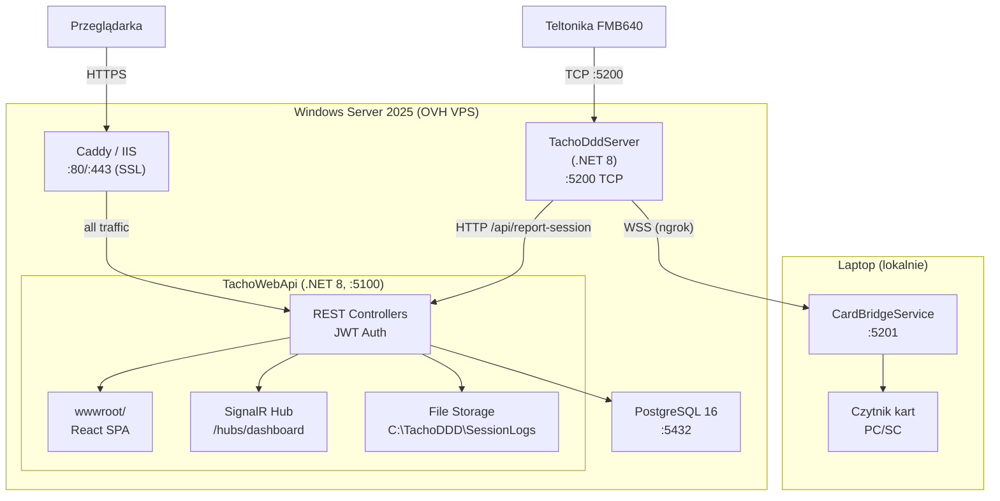

# Migracja TachoDDD Monitor — pełna instalacja na Windows Server

> **Cel dokumentu:** Krok po kroku zainstalować cały system (backend + frontend) na własnym serwerze Windows, zastępując Lovable Cloud własnym lokalnym backendem.

---

## Spis treści

1. [Architektura docelowa](#1-architektura-docelowa)
2. [Wymagania](#2-wymagania)
3. [Krok 1 — Instalacja PostgreSQL](#krok-1--instalacja-postgresql)
4. [Krok 2 — Pobranie kodu źródłowego](#krok-2--pobranie-kodu-źródłowego)
5. [Krok 3 — Konfiguracja TachoWebApi](#krok-3--konfiguracja-tachowebapi)
6. [Krok 4 — Migracja bazy danych (EF Core)](#krok-4--migracja-bazy-danych-ef-core)
7. [Krok 5 — Build frontendu React](#krok-5--build-frontendu-react)
8. [Krok 6 — Pierwsze uruchomienie i test](#krok-6--pierwsze-uruchomienie-i-test)
9. [Krok 7 — Tworzenie pierwszego admina](#krok-7--tworzenie-pierwszego-admina)
10. [Krok 8 — Konfiguracja TachoDddServer](#krok-8--konfiguracja-tachodddserver)
11. [Krok 9 — Instalacja jako Windows Service](#krok-9--instalacja-jako-windows-service)
12. [Krok 10 — Reverse proxy i SSL](#krok-10--reverse-proxy-i-ssl)
13. [Krok 11 — Firewall](#krok-11--firewall)
14. [Krok 12 — Weryfikacja](#krok-12--weryfikacja)
15. [Krok 13 — Backup bazy danych](#krok-13--backup-bazy-danych)
16. [Aktualizacja systemu](#aktualizacja-systemu)
17. [FAQ](#faq)

---

## 1. Architektura docelowa

TachoWebApi serwuje **zarówno API jak i frontend React** z jednego procesu — nie potrzebujesz osobnego serwera plików statycznych.

```
┌──────────────────────────────────────────────────────────┐
│ Windows Server 2025 (OVH VPS)                            │
│                                                          │
│  ├─ IIS / Caddy (reverse proxy, port 80/443)             │
│  │   └─ /* → TachoWebApi (Kestrel :5100)                │
│  │                                                       │
│  ├─ TachoWebApi (.NET 8, port 5100)                      │
│  │   ├─ Serwuje frontend React z wwwroot/                │
│  │   ├─ SPA fallback (wszystko → index.html)             │
│  │   ├─ JWT Auth (rejestracja, login, refresh)           │
│  │   ├─ REST API /api/* (sesje, urządzenia, harmonogram) │
│  │   ├─ SignalR Hub /hubs/dashboard (realtime)           │
│  │   ├─ File Storage (C:\TachoDDD\SessionLogs\)          │
│  │   └─ PostgreSQL (Npgsql / EF Core)                   │
│  │                                                       │
│  ├─ TachoDddServer (.NET 8, port 5200 TCP)               │
│  │   └─ raportuje do TachoWebApi /api/report-session     │
│  │                                                       │
│  └─ PostgreSQL 16 (port 5432)                            │
└──────────────────────────────────────────────────────────┘
```

---

## 2. Wymagania

| Komponent | Wymaganie |
|-----------|-----------|
| **OS** | Windows Server 2019+ (testowane na 2025) |
| **.NET** | .NET 8 SDK (do kompilacji i migracji), Runtime na serwerze |
| **PostgreSQL** | 15+ (zalecany 16) |
| **Node.js** | 18+ (do budowania frontendu) |
| **Git** | Do pobrania kodu z GitHub |
| **RAM** | min. 2 GB wolnego |
| **Dysk** | min. 10 GB wolnego |
| **Porty** | 5100 (API, wewnętrzny), 5200 (TCP urządzenia), 80/443 (web) |

---

## Krok 1 — Instalacja PostgreSQL

### 1.1. Pobranie i instalacja

1. Pobierz instalator z https://www.postgresql.org/download/windows/
2. Uruchom instalator, zainstaluj z domyślnymi ustawieniami
3. Zapamiętaj hasło użytkownika `postgres`

### 1.2. Utworzenie bazy i użytkownika

Otwórz **pgAdmin** lub **psql** (w terminalu PowerShell):

```powershell
& "C:\Program Files\PostgreSQL\16\bin\psql.exe" -U postgres
```

```sql
CREATE USER tachoddd WITH PASSWORD 'TWOJE_SILNE_HASLO';
CREATE DATABASE tachoddd OWNER tachoddd;
GRANT ALL PRIVILEGES ON DATABASE tachoddd TO tachoddd;
\c tachoddd
GRANT ALL ON SCHEMA public TO tachoddd;
\q
```

### 1.3. Weryfikacja połączenia

```powershell
& "C:\Program Files\PostgreSQL\16\bin\psql.exe" -U tachoddd -d tachoddd -h localhost
\q
```

---

## Krok 2 — Pobranie kodu źródłowego

```powershell
git clone https://github.com/TWOJ_USER/TWOJ_REPO.git
cd TWOJ_REPO
```

### Struktura projektu

```
├── src/                         ← Frontend React (źródła)
├── public/                      ← Statyczne assety frontendu
├── package.json                 ← Zależności npm frontendu
├── vite.config.ts               ← Konfiguracja buildu frontendu
├── csharp/
│   ├── TachoWebApi/             ← Backend ASP.NET Web API
│   ├── TachoDddServer/          ← Serwer TCP (Teltonika Codec 12)
│   └── CardBridgeService/       ← Serwis czytnika kart (laptop)
└── docs/                        ← Dokumentacja
```

---

## Krok 3 — Konfiguracja TachoWebApi

### 3.1. Edytuj `csharp/TachoWebApi/appsettings.json`

```json
{
  "ConnectionStrings": {
    "DefaultConnection": "Host=localhost;Port=5432;Database=tachoddd;Username=tachoddd;Password=TWOJE_SILNE_HASLO"
  },
  "Jwt": {
    "Key": "WYGENERUJ_MIN_32_ZNAKOWY_LOSOWY_SEKRET_JWT",
    "Issuer": "TachoWebApi",
    "Audience": "TachoDDD",
    "AccessTokenMinutes": 60,
    "RefreshTokenDays": 7
  },
  "ApiKey": "WYGENERUJ_LOSOWY_KLUCZ_API_DLA_SERWERA",
  "FileStorage": {
    "SessionLogsDir": "C:\\TachoDDD\\SessionLogs"
  },
  "Email": {
    "Enabled": false
  },
  "Cors": {
    "AllowedOrigins": [ "https://tachoddd.twojadomena.pl" ]
  },
  "Urls": "http://0.0.0.0:5100"
}
```

### 3.2. Jak generować sekrety

| Pole | Opis | Jak wygenerować (PowerShell) |
|------|------|------------------------------|
| `Password` | Hasło do PostgreSQL (z kroku 1.2) | — |
| `Jwt:Key` | Sekret JWT, min. 32 znaki | `[Convert]::ToBase64String((1..32 \| %{Get-Random -Max 256}) -as [byte[]])` |
| `ApiKey` | Klucz API dla TachoDddServer | `[guid]::NewGuid().ToString("N")` |

### 3.3. Utworzenie katalogów

```powershell
New-Item -ItemType Directory -Force -Path "C:\TachoDDD\SessionLogs"
New-Item -ItemType Directory -Force -Path "C:\TachoDDD\WebApi"
New-Item -ItemType Directory -Force -Path "C:\TachoDDD\DddServer"
New-Item -ItemType Directory -Force -Path "C:\TachoDDD\Backups"
```

---

## Krok 4 — Migracja bazy danych (EF Core)

### 4.1. Zainstaluj narzędzie EF Core

```powershell
dotnet tool install --global dotnet-ef
```

### 4.2. Utwórz migrację i zastosuj schemat

```powershell
cd csharp\TachoWebApi
dotnet ef migrations add Initial
dotnet ef database update
```

### 4.3. Weryfikacja tabel

```powershell
& "C:\Program Files\PostgreSQL\16\bin\psql.exe" -U tachoddd -d tachoddd -c "\dt"
```

Oczekiwane tabele: `auth_users`, `profiles`, `user_roles`, `user_devices`, `sessions`, `session_events`, `download_schedules`, `app_settings`, `__EFMigrationsHistory`

---

## Krok 5 — Build frontendu React

### 5.1. Zainstaluj Node.js

Pobierz LTS z https://nodejs.org/ i zainstaluj.

### 5.2. Skonfiguruj zmienną API

Utwórz plik `.env` w katalogu głównym repozytorium:

```env
VITE_API_BASE_URL=https://tachoddd.twojadomena.pl
```

> Jeśli testujesz lokalnie bez reverse proxy, użyj `VITE_API_BASE_URL=http://localhost:5100`

### 5.3. Zbuduj frontend

```powershell
# W katalogu głównym repozytorium
npm install
npm run build
```

Wynik: katalog `dist/` ze skompilowanym frontendem.

### 5.4. Skopiuj do TachoWebApi wwwroot

TachoWebApi serwuje pliki statyczne z katalogu `wwwroot/` obok swojego exe:

```powershell
# Po opublikowaniu backendu (krok 9.1) — skopiuj dist/ do wwwroot/
Copy-Item -Recurse -Force dist\* C:\TachoDDD\WebApi\wwwroot\
```

---

## Krok 6 — Pierwsze uruchomienie i test

### 6.1. Uruchomienie (dev mode)

```powershell
cd csharp\TachoWebApi
dotnet run
```

### 6.2. Test API

```powershell
# Powinno zwrócić [] (pusta lista)
Invoke-RestMethod -Uri "http://localhost:5100/api/app-settings" -Method Get

# Test rejestracji
$body = @{
    email = "admin@example.com"
    password = "MojeSilneHaslo123!"
    full_name = "Administrator"
} | ConvertTo-Json

Invoke-RestMethod -Uri "http://localhost:5100/api/auth/signup" -Method Post `
  -ContentType "application/json" -Body $body
```

### 6.3. Test frontendu

Otwórz przeglądarkę: `http://localhost:5100` — powinien załadować się dashboard React.

---

## Krok 7 — Tworzenie pierwszego admina

Po rejestracji (krok 6.2), nadaj rolę admina w bazie:

```powershell
& "C:\Program Files\PostgreSQL\16\bin\psql.exe" -U tachoddd -d tachoddd
```

```sql
-- Znajdź ID użytkownika
SELECT id, email FROM auth_users;

-- Nadaj rolę admin (wstaw UUID z powyższego zapytania)
INSERT INTO user_roles (id, user_id, role)
VALUES (gen_random_uuid(), 'WSTAW_UUID_USERA', 'admin');

-- Zatwierdź konto
UPDATE profiles SET approved = true WHERE id = 'WSTAW_UUID_USERA';

\q
```

Kolejnych użytkowników admin tworzy z dashboardu (panel admina → Utwórz użytkownika).

---

## Krok 8 — Konfiguracja TachoDddServer

Zaktualizuj `csharp/TachoDddServer/appsettings.json`:

```json
{
  "TcpPort": 5200,
  "CardBridgeUrl": "ws://TWOJ_NGROK_URL",
  "OutputDir": "C:\\TachoDDD\\Downloads",
  "TrafficLogDir": "C:\\TachoDDD\\Logs",
  "LogTraffic": true,
  "WebReport": {
    "Enabled": true,
    "Url": "http://localhost:5100/api/report-session",
    "ApiKey": "TEN_SAM_KLUCZ_CO_W_TACHOWEBAPI_APPSETTINGS"
  }
}
```

**WAŻNE:** `ApiKey` musi być identyczny z `ApiKey` w `TachoWebApi/appsettings.json`.

---

## Krok 9 — Instalacja jako Windows Service

### 9.1. Publikacja TachoWebApi

```powershell
cd csharp\TachoWebApi
dotnet publish -c Release -o C:\TachoDDD\WebApi
```

### 9.2. Skopiuj frontend do wwwroot

```powershell
# Upewnij się, że dist/ jest zbudowany (krok 5.3)
New-Item -ItemType Directory -Force -Path "C:\TachoDDD\WebApi\wwwroot"
Copy-Item -Recurse -Force dist\* C:\TachoDDD\WebApi\wwwroot\
```

### 9.3. Rejestracja TachoWebApi jako serwis

```powershell
sc.exe create TachoWebApi `
  binPath= "C:\TachoDDD\WebApi\TachoWebApi.exe" `
  start= auto `
  DisplayName= "TachoDDD Web API"

sc.exe description TachoWebApi "Backend API + Frontend dla TachoDDD Monitor"
sc.exe start TachoWebApi
```

### 9.4. Rejestracja TachoDddServer jako serwis

```powershell
cd csharp\TachoDddServer
dotnet publish -c Release -o C:\TachoDDD\DddServer

sc.exe create TachoDddServer `
  binPath= "C:\TachoDDD\DddServer\TachoDddServer.exe" `
  start= auto `
  DisplayName= "TachoDDD TCP Server"

sc.exe start TachoDddServer
```

### 9.5. Zarządzanie serwisami

```powershell
# Status
sc.exe query TachoWebApi
sc.exe query TachoDddServer

# Restart
sc.exe stop TachoWebApi && sc.exe start TachoWebApi

# Logi: Event Viewer → Windows Logs → Application
```

---

## Krok 10 — Reverse proxy i SSL

Reverse proxy (IIS lub Caddy) przekierowuje ruch z portów 80/443 na wewnętrzny Kestrel (:5100). TachoWebApi sam serwuje i API i frontend, więc cały ruch idzie do jednego backendu.

### Opcja A: Caddy (rekomendowana — auto-SSL)

Pobierz z https://caddyserver.com/download (Windows amd64).

Utwórz `C:\TachoDDD\Caddyfile`:

```
tachoddd.twojadomena.pl {
    reverse_proxy localhost:5100
}
```

To wszystko! Caddy automatycznie:
- Uzyskuje certyfikat Let's Encrypt
- Odnawia go co 60 dni
- Obsługuje HTTP→HTTPS redirect

```powershell
# Test
caddy.exe run --config C:\TachoDDD\Caddyfile

# Zainstaluj jako serwis
caddy.exe install --config C:\TachoDDD\Caddyfile
sc.exe start caddy
```

### Opcja B: IIS z URL Rewrite + ARR

1. Zainstaluj **URL Rewrite** i **Application Request Routing** (ARR) w IIS
2. Utwórz stronę IIS `tachoddd.twojadomena.pl`
3. Physical path: dowolny pusty katalog (np. `C:\inetpub\tachoddd`)

Dodaj `web.config`:

```xml
<?xml version="1.0" encoding="UTF-8"?>
<configuration>
  <system.webServer>
    <rewrite>
      <rules>
        <rule name="Reverse Proxy" stopProcessing="true">
          <match url="(.*)" />
          <action type="Rewrite" url="http://localhost:5100/{R:1}" />
        </rule>
      </rules>
    </rewrite>
    <webSocket enabled="true" />
  </system.webServer>
</configuration>
```

Dla SSL z IIS użyj **win-acme** (https://www.win-acme.com/):
```powershell
wacs.exe --target iis --siteid 1 --installation iis
```

---

## Krok 11 — Firewall

```powershell
# Porty publiczne
netsh advfirewall firewall add rule name="HTTP" dir=in action=allow protocol=TCP localport=80
netsh advfirewall firewall add rule name="HTTPS" dir=in action=allow protocol=TCP localport=443
netsh advfirewall firewall add rule name="TachoDddServer TCP" dir=in action=allow protocol=TCP localport=5200

# Port 5100 NIE otwieraj z zewnątrz — dostępny tylko przez reverse proxy
```

Sprawdź też porty w panelu OVH VPS (firewall zewnętrzny).

---

## Krok 12 — Weryfikacja

### Checklist

- [ ] PostgreSQL: `psql -U tachoddd -d tachoddd -c "\dt"` → lista tabel
- [ ] TachoWebApi: `Invoke-RestMethod http://localhost:5100/api/app-settings` → `[]`
- [ ] Rejestracja: POST `/api/auth/signup` → token
- [ ] Logowanie: POST `/api/auth/login` → token
- [ ] Frontend: `https://tachoddd.twojadomena.pl` → dashboard
- [ ] SignalR: DevTools → Network → WS → `/hubs/dashboard` → connected
- [ ] TachoDddServer: sesja DDD raportuje → `SELECT * FROM sessions;`
- [ ] API Key: `report-session` z x-api-key → OK, bez klucza → 401
- [ ] SSL: certyfikat ważny

### Testy endpointów

```powershell
# Login
$login = Invoke-RestMethod -Uri "http://localhost:5100/api/auth/login" `
  -Method Post -ContentType "application/json" `
  -Body '{"email":"admin@example.com","password":"MojeSilneHaslo123!"}'

$token = $login.access_token

# Sesje (jako admin)
Invoke-RestMethod -Uri "http://localhost:5100/api/sessions" `
  -Headers @{ Authorization = "Bearer $token" }

# Report-session (z API key)
Invoke-RestMethod -Uri "http://localhost:5100/api/report-session" `
  -Method Post -ContentType "application/json" `
  -Headers @{ "x-api-key" = "TWOJ_API_KEY" } `
  -Body '{"session_id":"test-001","imei":"358480081630115","status":"connecting"}'
```

---

## Krok 13 — Backup bazy danych

### Skrypt backup.ps1

Utwórz `C:\TachoDDD\backup.ps1`:

```powershell
$date = Get-Date -Format "yyyyMMdd_HHmmss"
$backupDir = "C:\TachoDDD\Backups"
$pgDump = "C:\Program Files\PostgreSQL\16\bin\pg_dump.exe"

if (!(Test-Path $backupDir)) { New-Item -ItemType Directory -Path $backupDir }

& $pgDump -U tachoddd -d tachoddd -F c -f "$backupDir\tachoddd_$date.backup"

# Usuń starsze niż 30 dni
Get-ChildItem "$backupDir\*.backup" | Where-Object {
    $_.LastWriteTime -lt (Get-Date).AddDays(-30)
} | Remove-Item -Force
```

### Task Scheduler (co noc o 3:00)

```powershell
$action = New-ScheduledTaskAction -Execute "powershell.exe" `
  -Argument "-ExecutionPolicy Bypass -File C:\TachoDDD\backup.ps1"
$trigger = New-ScheduledTaskTrigger -Daily -At 3am
Register-ScheduledTask -TaskName "TachoDDD Backup" -Action $action -Trigger $trigger `
  -User "SYSTEM" -RunLevel Highest
```

### Przywracanie backupu

```powershell
& "C:\Program Files\PostgreSQL\16\bin\pg_restore.exe" `
  -U tachoddd -d tachoddd -c "C:\TachoDDD\Backups\tachoddd_YYYYMMDD.backup"
```

---

## Aktualizacja systemu

### Aktualizacja backendu (po zmianach w C#)

```powershell
cd TWOJ_REPO
git pull

# Backend
cd csharp\TachoWebApi
dotnet publish -c Release -o C:\TachoDDD\WebApi
sc.exe stop TachoWebApi
sc.exe start TachoWebApi
```

### Aktualizacja frontendu (po zmianach w React)

```powershell
cd TWOJ_REPO
git pull
npm install
npm run build

# Skopiuj nowe pliki
Copy-Item -Recurse -Force dist\* C:\TachoDDD\WebApi\wwwroot\

# Restart nie jest wymagany — pliki statyczne serwowane są z dysku
```

### Aktualizacja obu

```powershell
cd TWOJ_REPO
git pull

# Frontend
npm install && npm run build

# Backend
cd csharp\TachoWebApi
dotnet publish -c Release -o C:\TachoDDD\WebApi

# Frontend do wwwroot
cd ..\..
Copy-Item -Recurse -Force dist\* C:\TachoDDD\WebApi\wwwroot\

# Restart backendu
sc.exe stop TachoWebApi && sc.exe start TachoWebApi
```

### Nowa migracja bazy (po zmianach w modelach C#)

```powershell
cd csharp\TachoWebApi
dotnet ef migrations add NazwaMigracji
dotnet ef database update
```

---

## Diagram docelowej architektury



---

## FAQ

**P: Czy mogę nadal rozwijać frontend w Lovable?**
O: Tak! Rozwijaj w Lovable, pushuj na GitHub, potem na serwerze: `git pull && npm run build && Copy-Item dist\* wwwroot\`.

**P: Jak przenieść użytkowników z Lovable Cloud?**
O: Nie ma bezpośredniej migracji auth. Utwórz użytkowników na nowo. Dane sesji/urządzeń można wyeksportować CSV i zaimportować do PostgreSQL.

**P: Czy mogę uruchomić na Linuxie?**
O: Tak, .NET 8 jest cross-platform. Zamiast `sc.exe` użyj `systemd`, zamiast Caddy na Windows — Caddy na Linux (lub nginx).

**P: Jak włączyć e-maile (reset hasła)?**
O: W `appsettings.json` ustaw `Email:Enabled = true` i skonfiguruj SMTP (np. smtp.gmail.com:587, Mailgun, Amazon SES).

**P: Czy potrzebuję IIS lub Caddy?**
O: Tak, do SSL (HTTPS) i obsługi portu 80/443. Kestrel sam serwuje frontend i API na :5100, ale reverse proxy zapewnia certyfikat SSL.
